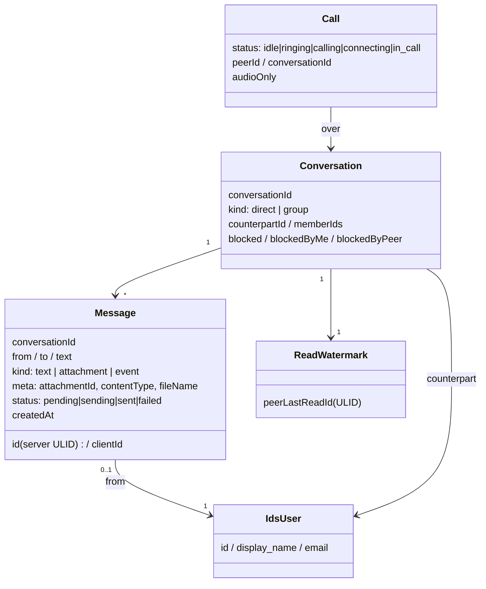
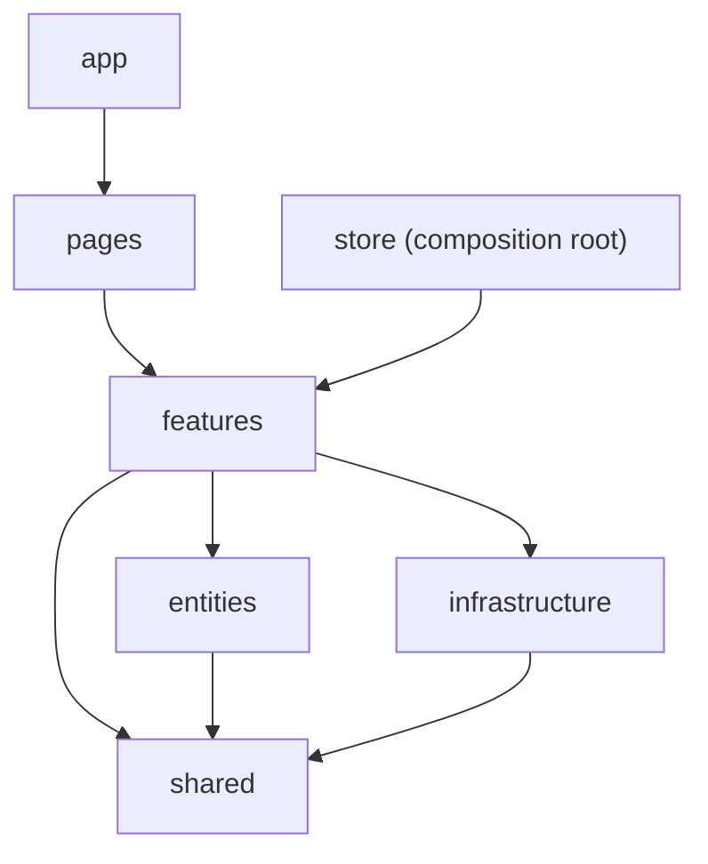

# 🐜 Hormiga Messenger — Web Client

A real-time **messaging + voice/video calling** Progressive Web App: the browser client for the
Quarkus **HormigaMessanger** backend, running behind the **Ory** edge. Chat, calls, attachments,
presence, read receipts, Web Push — installable, offline-capable, ES/EN.

> **Live:** `https://hormi.isolutions.io/messenger-ui/` · Auth is the same-origin **Ory Kratos** session (no separate login).

The app is a thin, well-layered front end over a real-time protocol: WebSocket for messaging/signaling,
WebRTC for media, REST (presigned MinIO) for attachments, and the IDS directory for names. The design goal
is a **clean domain model** and **strict layering** so the real-time complexity stays contained.

---

## What you can do (use cases)

| As a user I can… | How it works under the hood |
|---|---|
| **Sign in** without a separate login | reuses the same-browser Ory Kratos session cookie |
| **See my chats** (1:1 and groups), unread first | `GET /api/chats` ∪ `GET /api/groups`, names from the IDS directory |
| **Message in real time** with delivery + read state | optimistic **outbox** → WS `CHAT_IN` → `CHAT_ACK`; ✓/✓✓ from a per-side **ULID read-watermark** |
| See **typing** and **online/last-seen** | `TYPING_*` / `PRESENT_*` frames |
| **Send voice / photo / video / file** | two-phase **presigned MinIO** upload; client-side image compress + video caps + thumbnails |
| **Call** (audio or video), and **answer a call whose app was closed** | WebRTC over `SIGNAL_IN/OUT`; Web Push wakes the callee, who re-joins via a `call:ready` re-offer |
| Get **notifications** naming the sender | dual channel (in-app + Web Push) through one Service-Worker arbiter, sender name from a persistent cache |
| **Block/unblock**, **delete** a message | mutual block gating; author-checked delete |
| Work **offline / reopen instantly** | PWA app-shell precache + IndexedDB caches (history, media, names) |
| Use it in **Spanish or English** | `react-i18next`, persisted toggle |

---

## Domain model

The core entities the whole app is organized around (`entities/*`, `features/*/model`):

- **Conversation** — a 1:1 pair or an N-member group. Empty conversations are hidden from the list until a
  message revives them (the client keeps a *sticky* copy so a just-opened empty chat stays visible).
- **Message** — text or an attachment (`meta` carries `attachmentId`/`contentType`/`fileName`); reconciled by
  `id || clientId` so an optimistic echo and its server ACK collapse to one row.
- **Call** — a WebRTC session; the signaling (`call:offer|answer|ice|end|ready`) rides opaquely inside the
  backend's `SIGNAL_IN/OUT` frames, so the backend never parses it.
- **Read state** — a per-side monotonic **ULID watermark** (`peerLastReadId`): my message shows ✓✓ ⇔
  `msg.id <= peerLastReadId` (lexicographic = chronological).

---

## Architecture — Feature-Sliced Design

Layers with a strict **downward-only** dependency rule (a lower layer never imports an upper one):

| Layer | Role | e.g. |
|---|---|---|
| `app` | root shell, providers | `App`, error boundary |
| `pages` | route composition | `Messenger` |
| `features` | one user-facing capability each, self-contained | `chat`, `call`, `contacts`, `groups`, `presence`, `notifications`, `directory`, `auth` |
| `entities` | cross-feature domain types + mappers | `conversation`, `contact` |
| `infrastructure` | generic transport, no domain knowledge | WebSocket middleware, `frameBridge` |
| `shared` | pure utils, config, UI atoms, sound | `config/*`, `sound/notify`, `ulid` |
| `store` | the composition root (wires it all) | `store.ts`, `logout.ts` |

**Sources of truth (deliberately several, each owned by one place):** chat list = RTK Query `getChats`;
history = `getChatHistory`; unread = `chatUi` slice; presence = `presence` slice; calls = a singleton
`webRTCService` + `call` slice; the outbox = `outbox` slice + IndexedDB. Incoming WS frames are routed
per-frame in feature middleware — never through a single "last message" slot.

---

## How the hard parts work

- **Sending** — a message is enqueued in the outbox and echoed optimistically; the WS `CHAT_ACK` marks it
  sent (no history refetch — the row is reconciled in place). Resends are **epoch-guarded** (at most once per
  reconnect) because the server re-mints ids, so a naive resend would duplicate.
- **Calls, closed-app answer** — the push is only a *nudge* (no SDP). The callee opens, sends `call:ready`
  once its socket is up, the still-ringing caller re-offers with an **ICE restart** (its first candidates were
  emitted while the callee was offline), and both converge. The state machine never sends `call:end` to the
  peer it is answering, and carries the **conversationId from the offer itself** so you can answer a caller you
  have no listed chat with.
- **Attachments** — two-phase presigned MinIO (`upload-url` → PUT → confirm); the URL host is the public edge
  so the browser can reach it same-origin (no CORS). Bytes are fetched into a Blob and cached, so an expiring
  presigned URL can never blank a shown attachment.

---

## Supporting functions

- **Notifications — one arbiter, two channels.** In-app (live WS → `postMessage`) and offline (**Web Push**)
  both converge in the Service Worker, which dedups by message id and names the sender/caller from a
  persistent cache. Calls are exempt from dedup + foreground-suppression (a call must always ring).
- **Caches (all IndexedDB, best-effort):**
  - `hormiga-msg-db` (v5) — **media blob cache**: images/voice/video keyed by `attachmentId`, byte-bounded
    with oldest-first eviction; also the **history** cache for instant/offline chat open.
  - `hormiga-names` — **directory name cache**: `id→name`, written as the address book resolves, read by both
    the app (read-through seed on cold start) **and** the Service Worker (to name Web Push offline).
  - `hormiga-push-dedup` — cross-channel notification dedup (survives restarts).
- **Offline / PWA** — `vite-plugin-pwa` precaches the app shell; a controller-change auto-reload untraps stale
  Service Workers after a deploy.
- **i18n** — every visible string via `react-i18next` (ES/EN, persisted).
- **Security (E2EE hardening, phase 0 shipped)** — strict enforcing CSP with a runtime-hashed inline script,
  pinned dependencies (`npm ci`); closed-chat E2EE (static ECDH → HKDF → AES-GCM) is implemented and inert on a
  branch, waiting on a backend key directory.

---

## Tech stack

**Client:** React 19 · Redux Toolkit + RTK Query · React Router 7 · react-i18next · `idb` (IndexedDB) · Zod ·
Vite 7 + `vite-plugin-pwa` · WebRTC · Web Push. **Auth:** Ory **Kratos** (session cookie, via the Ory edge).
**Backend (separate services):** Quarkus messenger (WebSocket + REST) · Kafka · MinIO (attachments) ·
PostgreSQL · the **IDS** identity directory (KratosGate) — all behind the Ory/nginx edge.

---

## Statistics

| Metric | Value |
|---|---|
| Source files (TS/TSX, excl. tests) | **125** (~**9,550** LOC) |
| Test files / tests | **53 / 319** (Vitest + Testing Library, jsdom, fake-indexeddb) |
| FSD layer spread | features 93 · shared 15 · entities 5 · infrastructure 5 · store 2 · app/pages 2 |
| Shipped JS (gzip) | **~210 KB** total — React ~120 KB · app ~38 KB · Ory ~22 KB · messenger route ~19 KB · webp-WASM ~15 KB |
| Route-level code splitting | yes (React.lazy per page) |

### Cache & capture configuration (`shared/config/*`)

| Setting | Value | Purpose |
|---|---|---|
| `ATTACHMENT_CACHE_MAX_BYTES` | 80 MB | media blob cache budget (oldest-first eviction) |
| `MAX_ATTACHMENT_BYTES` | 25 MB | upload size cap |
| `IMAGE_MAX_DIMENSION` / `IMAGE_QUALITY` | 1200 px / 0.8 | client image downscale→WebP before upload |
| `THUMB_MAX_DIMENSION` / `THUMB_QUALITY` | 320 px / 0.6 | cached inline thumbnails/posters |
| `VIDEO_CAPTURE_MAX_DIMENSION` / `_FRAME_RATE` | 1280 px / 24 fps | recording caps |
| `VIDEO_CAPTURE_BITS_PER_SECOND` / `_MAX_BYTES` | 1.2 Mbps / 22 MB | recording bitrate + auto-stop size |
| `VIDEO_MAX_DURATION_MS` / `VOICE_MAX_DURATION_MS` | 60 s / 3 min | recording length caps |
| `AUDIO_PLAYBACK_GAIN` | 2.5× | voice-note playback boost |
| `HISTORY_PAGE_SIZE` / `MESSAGE_WINDOW_*` | 200 / 60 | history paging + DOM windowing |
| `CALL_TIMEOUT_MS` | 60 s | outgoing-call ring window |
| `OUTBOX_*` | 6 attempts / 20 s ack / 3 s tick | duplicate-safe, epoch-guarded resend |

---

## Build & deploy

Node 22 assumed (`node_modules` not committed). `npm ci && npx vite build --base=/messenger-ui/` produces
`dist/`, served by a zero-dependency static server (`front/server.mjs`, which sets the enforcing CSP + cache
headers). Deploy builds the container **on the host** (`front/Dockerfile`, `npm ci` + Vite) via `deploy.sh`,
which verifies the edge returns 200. Full test gate: `npx vitest run`.

---

## License

**GNU General Public License v3.0** — see [LICENSE](./LICENSE). Free software: use, study, modify and
share it, including commercially, provided derivatives stay open under the GPL and ship their source.

> Relicensed from PolyForm Noncommercial to GPL-3.0 to adopt the Signal-protocol E2EE library
> (`@privacyresearch/libsignal-protocol-typescript`, GPL-3.0) — the best technical basis for the
> closed-chat encryption. Copyleft applies to this frontend project.
